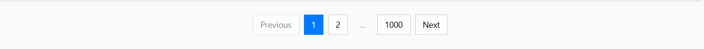
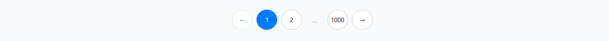
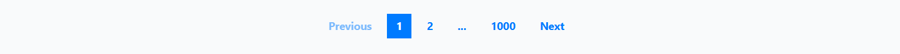
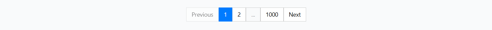

# react-awesome-paginate
React awesome paginate is a modern, typescript based pagination component. You can use it in your project.

[](https://nodei.co/npm/react-awesome-paginate/)

# Installation

Install `react-awesome-paginate` with [npm](https://www.npmjs.com/package/react-awesome-paginate):

```
npm i react-awesome-paginate --save
```
### Props & Theme demo [Codesandbox](https://codesandbox.io/p/sandbox/keen-elbakyan-35rmmg)
### API demo [Codesandbox](https://35rmmg.csb.app/api-example)

## Preview

### Default theme


### Circular theme


### Classic theme


### Compact theme


# Import and Usage rule in your component

```
import Pagination from 'react-awesome-paginate'; // Import npm module
import 'react-awesome-paginate/dist/index.css'; // Import CSS (You can override)


// In your page
<Pagination
    currentPage=1
    totalPages=20
    onPageChange={(pageNo: number) => console.log(pageNo)}
/>
```

# Detail Usage

```
import React, { useState } from "React";
import Pagination from 'react-awesome-paginate';

// For CSS Styling, you have to import this below file (You can override, if you want.)

import 'react-awesome-paginate/dist/index.css';

const ExampleComponent = () => {
    const [currentPage, setCurrentPage] = useState(1);
    const [totalPages, setTotalPages] = useState(1);


    const handlePageChange = (pageNo) => {
        if(pageNo === currentPage)
            return;

        // API Call && Set current page 
    }

    return (
        <Pagination
            currentPage={currentPage}
            totalPages={totalPages}
            onPageChange={(pageNo: number) => handlePageChange(pageNo)}
        />
    )
}

export default ExampleComponent;

```

## Events

| Name     | Type     | Status   | Description |
|----------|----------|----------|----------|
| `onPageChange`| Function | Required | `onPageChange` is a Function. When event is triggerd it gives triggered page no. as a argument. |


## Props

| Name     | Type     | Status   | Description |
|----------|----------|----------|----------|
| `currentPage`| Number | Required | `currentPage` number. Default value 1 |
| `totalPages`| Number | Required | `totalPages` number. Default value 1 |
| `previousLabel`| String | Optional | `previousLabel` for previous button. Default value `Previous` |
| `nextLabel`| String | Optional | `nextLabel` for next button. Default value `Next` |
| `morePagesLabel`| String | Optional | `morePagesLabel` for break level. Default value `...` |
| `paginationTheme`| String | Optional | `paginationTheme` for next button. Default value `default`. There are four types of theme, you can use, these are `default`, `circular`, `classic`, `compact`  |
| `activeClassName`| String | Optional | `activeClassName` for active button. Default value `active`. You can add your own custom class & give custom style in your component |
| `containerClassName`| String | Optional | `containerClassName` for active button. Default value `None`. You can add your own custom container class & give custom style in your component |
| `prevClassName`| String | Optional | `prevClassName` for active button. Default value `None`. You can add your own custom class & give custom style to previous button in your component |
| `nextClassName`| String | Optional | `nextClassName` for active button. Default value `None`. You can add your own custom class & give custom style to next button in your component |


###
If you like this package please give me a star(*) in my [Github Repo](https://github.com/iamsukanta/react-awesome-paginate)

##
If you find any issue please please report here [Github Issues](https://github.com/iamsukanta/react-awesome-paginate/issues)

### Awesome React Pagination npm | Easy installation | You can do everything custom